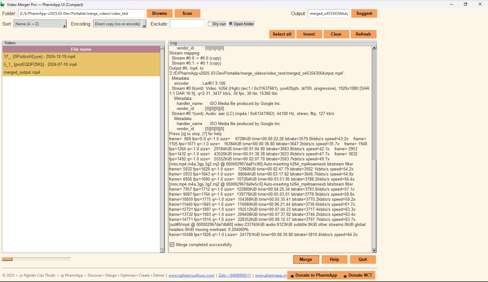

# VideoMergerPro v4 — PharmApp UI (Compact)

Gộp **tất cả video trong 1 thư mục** thành **một file MP4** bằng vài cú click.
Bản v4 dùng giao diện **PharmApp** gọn chiều cao, có **ffmpeg nhúng** (không cần cài đặt), và nhiều tuỳ chọn nâng cao.

> File chạy: **`VideoMergerPro_v4.exe`** (portable, không cần cài)
> Hệ điều hành: **Windows 10/11 (x64)**
> Tải về: vào tab **Releases** của repo (đính kèm `.exe` + checksum)

---

## ✨ Tính năng chính

* 🗂 **Quét & gộp video theo thư mục** (không cần chọn từng file)
* ↕ **Sắp xếp**: theo **Tên (A→Z / Z→A)** hoặc **Thời gian sửa** (cũ→mới, mới→cũ)
* 🔎 **Exclude keyword**: loại file không muốn gộp (vd: `_0.5x`)
* ✅ **Chọn nhanh**: *Select all / Invert / Clear / Refresh*
* 🎛 **Encoding modes**

  * **Direct copy (no re-encode)**: nhanh, giữ nguyên chất lượng *(các clip phải tương thích codec/container)*
  * **Re-encode H.264 + AAC**: tương thích rộng
  * **Re-encode H.265 + AAC**: dung lượng nhỏ hơn (chậm hơn)
* 🧪 **Dry-run**: chỉ hiển thị lệnh ffmpeg, **không chạy** (để kiểm tra)
* 📂 **Open folder when done**: mở thư mục đầu ra sau khi merge
* 💾 **Tự lưu cấu hình** vào `video_merger_config.json`
* 🎨 **PharmApp Theme**: màu nền #fdf5e6, nút #f4a261, heading Treeview #b5838d…

---

## 📦 Tải về & chạy

1. Tải **`VideoMergerPro_v4.exe`** từ tab **Releases** của repo.
2. (Khuyến nghị) Kiểm tra **SHA256**:

   ```powershell
   certutil -hashfile .\VideoMergerPro_v4.exe SHA256
   ```
3. Chạy file `.exe`. Nếu SmartScreen cảnh báo:

   * Chọn **More info → Run anyway**.

> Ứng dụng **portable**: xoá file `.exe` là “gỡ cài đặt”.
> App tạo file cấu hình cạnh `.exe`: `video_merger_config.json`.

---

## 🧭 Hướng dẫn sử dụng

1. **Folder** → bấm **Browse** chọn thư mục chứa video → **Scan**.
2. **Sort** chọn cách sắp xếp. **Exclude** nhập từ khoá để loại (vd: `_0.5x`).
3. Chọn các file trong bảng (mặc định chọn tất cả).
   Dùng **Select all / Invert / Clear / Refresh** để thao tác nhanh.
4. **Output**: gõ tên file hoặc bấm **Suggest** để gợi ý `TênThưMục_merged.mp4`.
5. **Encoding**:

   * **Direct copy (no re-encode)**: nhanh nhất, không đổi chất lượng.
     ⚠️ Dùng khi **tất cả** clip có **codec/parameter tương thích** (thường cùng H.264 + AAC, cùng profile/level).
   * **Re-encode (H.264/H.265 + AAC)**: chậm hơn nhưng **chắc chắn tương thích**.
6. Tuỳ chọn:

   * **Dry-run**: chỉ in lệnh ffmpeg (debug), không thực thi.
   * **Open folder**: mở thư mục sau khi xong.
7. Bấm **Merge** → chờ log báo **“✅ Merge completed successfully.”**
   File đầu ra nằm ngay trong thư mục nguồn (hoặc theo đường dẫn bạn nhập).

---

## 🖼 Giao diện



---

## ⚙️ Chi tiết kỹ thuật

* **Cơ chế gộp**: `ffmpeg` concat demuxer với file list tạm thời:

  ```
  file 'path/to/clip1.mp4'
  file 'path/to/clip2.mp4'
  ...
  ```
* **Direct copy**: `-c copy` *(không re-encode)*. Nhanh nhưng **đòi hỏi tương thích** thông số dòng.
  Nếu ffmpeg báo lỗi hoặc out-of-sync → hãy dùng chế độ **Re-encode**.
* **Re-encode H.264/H.265**:

  * H.264: `-c:v libx264 -c:a aac -crf 21 -preset medium -movflags +faststart`
  * H.265: `-c:v libx265 -c:a aac -crf 24 -preset slow -movflags +faststart`
* **ffmpeg nhúng**: ứng dụng ưu tiên **`./ffmpeg/ffmpeg.exe`**. Nếu không có, fallback sang `ffmpeg` trong PATH.
* **Tập tin tạm**: file danh sách concat nằm trong thư mục tạm của hệ thống và tự xoá sau khi chạy.
* **Log**: hiển thị toàn bộ stdout/stderr của ffmpeg (đã xử lý lỗi mã hoá ký tự Windows).

---

## 🧩 Yêu cầu & tương thích

* Windows 10/11 (x64)
* Quyền ghi file vào thư mục nguồn (để lưu file đầu ra)
* Không cần cài `ffmpeg` nếu bạn đi kèm `./ffmpeg/ffmpeg.exe`

---

## ❓ Câu hỏi thường gặp (FAQ)

**1) Bấm Merge bị lỗi “concat” hoặc video phát bị lệch tiếng/hình?**
→ Dùng chế độ **Re-encode H.264** (hoặc H.265). Chế độ **Direct copy** chỉ dùng khi tất cả clip cùng codec/parameter.

**2) Có gộp được `.avi`, `.mov`, `.mkv`?**
→ Có. Nhưng **Direct copy** chỉ ổn khi tương thích. Không thì chọn **Re-encode**.

**3) Ứng dụng có gửi dữ liệu ra internet không?**
→ **Không**. Mọi xử lý đều **offline** trên máy bạn.

**4) File đầu ra nằm ở đâu?**
→ Mặc định trong **cùng thư mục** video nguồn (hoặc đúng đường dẫn bạn nhập ở **Output**).

**5) Tạo file rất nhanh nhưng file mở không chạy?**
→ Hãy dùng **Re-encode** để đảm bảo tương thích trình phát.

---

## 🛠 Troubleshooting

* **SmartScreen/Antivirus chặn**: chọn *Run anyway* hoặc thêm vào whitelist.
* **Không thấy video khi Scan**: kiểm tra phần **Exclude** có chặn nhầm; kiểm tra phần mở rộng (`.mp4`, `.mkv`, …).
* **Đường dẫn có ký tự đặc biệt**: app đã escape; nếu vẫn lỗi, thử copy video sang thư mục không dấu/không ký tự lạ.
* **Thiếu quyền ghi**: chạy app ở thư mục có quyền hoặc **Run as administrator** (nếu cần).

---

## 📝 Changelog (v4)

* Giao diện **PharmApp UI (Compact)**
* **Exclude keyword**, **Dry-run**, **Open folder**, **Suggest output**
* **Select all / Invert / Clear / Refresh**
* **ffmpeg nhúng** (ưu tiên `./ffmpeg/ffmpeg.exe`)
* Sửa lỗi log **Windows charmap**; cải thiện ổn định đường dẫn & ký tự Unicode

---

## 🔒 Giấy phép & ghi công

* Ứng dụng: xem LICENSE của repo (nếu có).
* **ffmpeg**: tuân theo **(L)GPL** của FFmpeg. Vui lòng tham khảo [https://ffmpeg.org](https://ffmpeg.org) và đính kèm/viện dẫn license phù hợp khi phân phối.

---

## 💬 Liên hệ & Ủng hộ

* 🌐 **[www.nghiencuuthuoc.com](http://www.nghiencuuthuoc.com)** · 🌐 **[www.pharmapp.vn](http://www.pharmapp.vn)**
* Zalo: **+84 888 999 311**
* 💙 Donate PharmApp: `https://www.pharmapp.vn/Donate`
* 💝 Donate NCT: `https://www.nghiencuuthuoc.com/p/donate.html`

---

